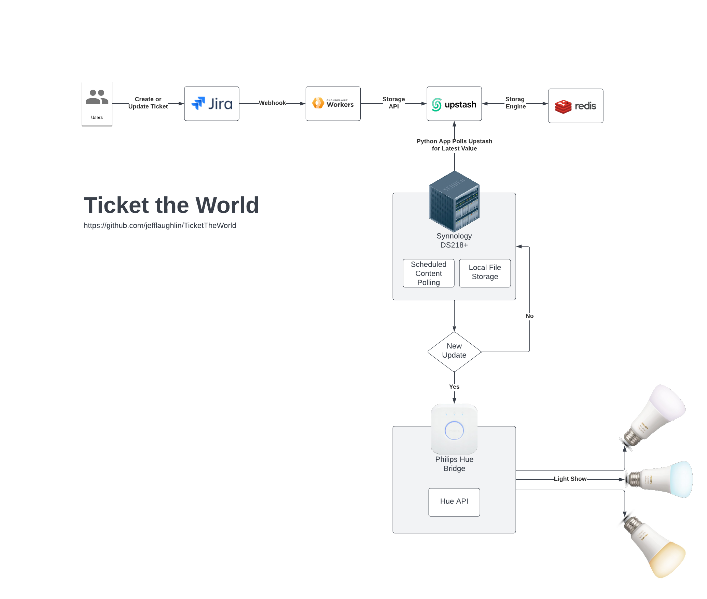

# Ticket The World

A visual alerting pipeline that is activated by Jira ticket creation/updates. This system integrates Jira webhooks with cloud-based services that are polled from a local Python script responsible for telling calling a local Philips Hue light to update its light display.

_Ticket The World_ helps you keep an eye on the creation and progress of Jira tickets in your organization. Jira is capable of sending out status updates when events happen but they require you to check your email on a regular basis. There are numerous Jira integrations available to help distribute messages (such as this [Slack connector](https://www.atlassian.com/software/jira/guides/expand-jira/jira-slack-integration)) but I didn't see anything that met my exact needs - providing visual feedback on Jira updates.

## Setup and Configuration

1. Step through the hue-api setup Python scripts. `configure-user.py` and then `configure-lights.py` They will create a config.json file for your particular environment.
1. Create an account on Upstash and an endpoint for your data with a Redis backend. The free version allows up to 10,000 commands per day which should be more than enough for any reasonable usage.
1. Create an account with Netlify. Set a new Environment Variable in Netlify's UI called `UPSTASH_ENDPOINT` and set it to the address generated in the previous step. Configure the `netlify-bridge-api`.
1. Customize the Jira webhook listener on the Settings > System > Webhooks Jira page. You will need to configure the webhook to send for just a limited set of Jira events to avoid being overrun with updates (Jira is quite chatty). The webhook URL should connect to the Netlify site configured previously such as `https://sitename.netlify.app/json` Modify the `issue-related events` section with a JQL query and filtering for just the Issues, Comments, properties that you are interested in. [Image: WebHook Configuration](/images/webhooks.png)
1. Update the NodeJS project with the Upstash endpoint information so that it can be scheduled to poll for the latest ticket information. When new content is found send a command to the Hue API to update lighting.

## Why this project is useful?

_Ticket the World_ provides visual feedback when tickets are created or updated in Jira. Your lights will turn on, they may play a scene or switch to an obvious colour when an event happens in your Jira board. Now you don't even need to check your email to know that your Jira project is active - your lights will let you know.

&nbsp;

## Why did you use 'service x' instead of another other service?

As with many real-world tasks there are often multiple ways to achieve the same, or similar, results. The choices made here are ones that suited my needs without requiring a large investment in time, money, or resources. You may find that you prefer some services that I chose not to use - if so I encourage you to swap out my choices for yours.

In my particular case I had a Synology NAS at home that is capable of running Python 3 scripts so I used it to poll for tickets and update my local lights. I had also used Netlify for a small personal project previously and was quite impressed with their system so it felt like a good natural fit. Upstash and Redis were new to me but were quick and powerful and were a joy to work with.

&nbsp;

## How can users get started with using this project?

This project was built to suit my particular needs so you may wish to customize or adapt the overall project to beter suit your requirements. You will require access to all items list in the [Systems and Services](#systems-and-services-used) section below. All web application services were kept as low-cost (or free) wherever possible though actual pricing is often based on usage.

1. Clone the [Github repository](https://github.com/jefflaughlin/TicketTheWorld/)
2. Sign up for the required services or replace each one with your own preferred option
3. Update the application code with service addresses, API values, and configure implementation options to suit your needs

&nbsp;

## Where are users able to get help with this project?

[Github Issues for Ticket the World](https://github.com/jefflaughlin/TicketTheWorld/issues)

&nbsp;

## Systems and Services Used

| Service                                                    | Function                                                                                 |
| ---------------------------------------------------------- | ---------------------------------------------------------------------------------------- |
| [Jira](https://www.atlassian.com/software/jira)            | Built for every member of your software team to plan track, and release great software.  |
| [Netlify](https://www.netlify.com/)                        | A single, simple workflow for building high performance sites and apps.                  |
| [Upstash](https://upstash.com/)                            | Serverless Data for Redis                                                                |
| [Redis](https://redis.io/)                                 | In-memory data store used as a database, cache, streaming engine, and message broker     |
| [Synology](https://www.synology.com/en-us/products/DS220+) | Compact network-attached storage solution. Accelerate demanding applications             |
| [Philips Hue](https://www.philips-hue.com/en-ca)           | Not just a smart bulb, it's a smart lighting system                                      |
| [Python 3](https://www.python.org/)                        | A programming language that lets you work quickly and integrate systems more effectively |
| [Visual Studio Code](https://code.visualstudio.com/)       | A streamlined code editor with support for development operations                        |
| [Github](https://github.com)                               | Build, ship, and maintain software                                                       |

&nbsp;

&nbsp;

## Who maintains and contributes to the project

This project is built and maintained by [Jeff Laughlin](https://github.com/jefflaughlin). If you would like to get involved please reach out and let me know.
